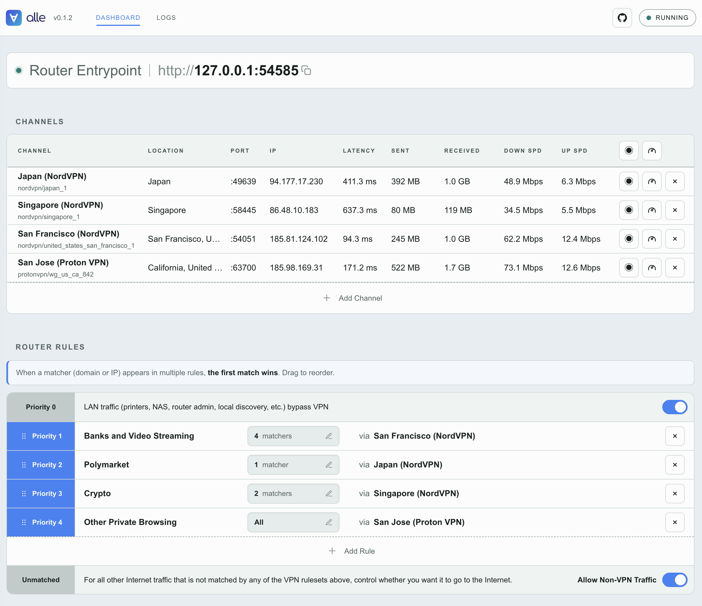

<p align="center">
  
</p>

<p align="center">
  <a href="https://github.com/zydo/alle/actions/workflows/ci.yml"></a>
  <a href="https://pypi.org/project/alle-proxy/"></a>
</p>

# alle

A universal VPN client that manages multiple VPN connections with rule-based routing.

<p align="center">
  
</p>

# Why alle

Most VPN clients are built around one global idea: connect this device to a single
VPN server, then send everything through it until you disconnect or switch.

That is not enough when different resources need to appear from different regions
— a geo-fenced stream, a bank that blocks foreign IPs, a region-locked test
environment. Switching origins means disconnecting from one server and reconnecting
to another, and the official client on one machine usually cannot keep several
locations active at once anyway.

`alle` keeps multiple VPN exits live at the same time, from one provider or mixed
across several. Say you want a US exit, a UK exit, and a Japan exit at once —
NordVPN for the US and Japan, ProtonVPN for the UK:

```text
   streaming + admin   ──►  alle  ──►  United States   (NordVPN)
   test runner         ──►  alle  ──►  Japan           (NordVPN)
   bank login          ──►  alle  ──►  United Kingdom  (Proton VPN)
```

Each app points at the exit it needs; they run concurrently and independently, so
opening the bank never disturbs the stream.

In short: not one global location you keep switching, but several exits alive at
once, each used where it is needed.

## What alle does

`alle` runs multiple VPN exits side by side. Each exit is exposed as its own
local HTTP+SOCKS proxy on `127.0.0.1:<port>`. A single HTTP+SOCKS router
entrypoint routes traffic by rule (domain, IP) to a VPN exit, to direct
outbound, or blocks it. Instead of changing your whole machine's VPN location,
you point each app, browser profile, script, or test job at the path it needs.

Under the hood, `alle` manages one
[`sing-box`](https://github.com/SagerNet/sing-box) process. Each channel becomes
one local proxy inbound routed through one WireGuard VPN peer. Channels can come
from different providers, so a NordVPN exit and a Proton VPN `.conf` import can
run at the same time.

## Current status

`alle` is usable today as a CLI-first client for per-app/per-workflow VPN exits.

**Providers**

| Provider   | Support                                                                   |
| ---------- | ------------------------------------------------------------------------- |
| NordVPN    | Token/API setup, location selection, automatic WireGuard channel creation |
| Proton VPN | WireGuard `.conf` import                                                  |

**Platforms**

| Platform | Support   |
| -------- | --------- |
| macOS    | Supported |
| Linux    | Supported |
| Windows  | Planned   |

**Features**

| Phase             | Status                                                                                                           |
| ----------------- | ---------------------------------------------------------------------------------------------------------------- |
| Core CLI          | Providers, channels, per-channel proxies, status, tests, logs, metrics                                           |
| Routing           | Ruleset-based router entrypoint with domain/CIDR/all matchers, kill-switch, CLI shadow lint, built-in LAN bypass |
| Web UI            | Dashboard (channels, probe/speed, routes, kill-switch) + Logs page                                               |
| Desktop companion | Planned                                                                                                          |
| Distribution      | PyPI CLI package; native installers planned                                                                      |

## Install

`alle` is a Python CLI (Python 3.10+) installed as a user-level tool — no sudo.
Two recommended, fully explicit paths; each step is an ordinary command you can
inspect, and the tool that installed `alle` is also the one that upgrades and
uninstalls it.

**With [`uv`](https://docs.astral.sh/uv/getting-started/installation/):**

```bash
# 1. install uv (see its docs for other methods)
curl -LsSf https://astral.sh/uv/install.sh | sh
# 2. install the alle CLI
uv tool install alle-proxy
# 3. (optional) run the background daemon at login, so channels survive a reboot
alle daemon install
```

**With [`pipx`](https://pipx.pypa.io/stable/):**

```bash
# 1. install pipx (e.g. `brew install pipx` or your distro's package)
# 2. install the alle CLI
pipx install alle-proxy
# 3. (optional) run the background daemon at login
alle daemon install
```

Step 3 is optional: without it the runtime auto-starts on first use (`alle start`
or the first channel you add) and runs for the session. `alle daemon install`
registers it as a user-level login service (macOS LaunchAgent / `systemd --user`)
so it starts at login and is supervised — see the
[CLI reference](docs/cli-reference.md#alle-daemon).

Also works: `python -m pip install alle-proxy` into an environment you manage,
or one-off runs with `uvx --from alle-proxy alle --help`.

After installation:

```bash
alle version
alle --help
```

**Uninstall** with the same tool that installed it — `uv tool uninstall
alle-proxy` or `pipx uninstall alle-proxy` (run `alle stop` first). `~/.alle`
is left behind since it holds your provider credentials and WireGuard keys; a
reinstall picks up where you left off. Remove it with `rm -rf ~/.alle` if you
want everything gone.

## Quick start

Add a provider, create a channel, start the runtime, then use the channel's local
proxy port.

```bash
alle providers add nordvpn
alle channels add nordvpn --country "United States"
alle start
alle channels ls
```

`alle channels ls` prints the local proxy port for each channel:

```text
LABEL            ID                       PORT    COUNTRY        CITY
---------------  -----------------------  ------  -------------  ----------
united_states_1  nordvpn/united_states_1  :53124  United States  (Any City)
```

Use that port from any tool or app that supports an HTTP or SOCKS proxy:

```bash
curl -x http://127.0.0.1:53124 https://api.ipify.org
```

Check health and traffic:

```bash
alle status
alle test
alle metrics
```

**Provider setup**

`alle` supports two provider setup styles today:

**NordVPN** uses an access token:

```bash
alle providers add nordvpn
alle locations nordvpn
alle locations nordvpn --country "United States"
alle channels add nordvpn --country "United States" --city "Seattle"
```

**Proton VPN** uses WireGuard config files downloaded from Proton:

```bash
alle providers add protonvpn
alle channels add protonvpn --config ~/Downloads/wg-US-CA-842.conf
```

Re-importing the same `.conf` file updates that channel in place, keeping the
same channel id and local port.

**Friendly names**

Channels are identified by a globally-unique, provider-qualified id
(`nordvpn/united_states_1`) — the handle every command takes, shown in the `ID`
column. You can also give one a display label for readability (the `LABEL`
column in `channels ls`, `status`, `test`, and `metrics`). The id never changes,
so relabelling is always safe:

```bash
alle channels add nordvpn --country "United States" --label "Streaming - US"
alle channels setlabel united_states_1 "Streaming - US"   # or set it later
alle channels setlabel united_states_1                    # omit text to clear
```

**Common commands**

Useful commands after setup:

```bash
alle providers ls
alle channels ls
alle channels ls --refs
alle status
alle test
alle metrics
alle logs
alle stop
```

Most read commands support `--json` for scripts:

```bash
alle status --json
alle channels ls --json
alle metrics --json
```

Channel and provider removals accept multiple targets:

```bash
alle channels rm japan_1 united_states_seattle_1
alle channels rm protonvpn/wg_us_ca_842
alle channels rm 'united_states_*' --dry-run
alle providers rm nordvpn protonvpn -y
```

For the complete command reference, see the
[CLI Reference](docs/cli-reference.md).

## Rule-based routing

Besides the per-channel ports, `alle` runs one **router entrypoint** — a single
local HTTP+SOCKS proxy that dispatches each connection by rule to a channel, to
`direct` (no VPN), or to `block`. The entrypoint is always on: with no rules it
is a transparent pass-through, and traffic only uses a VPN exit once you wire a
rule to one. Its port is assigned once and stays stable (`alle status` shows it),
so apps and future OS-level profiles can point at it permanently.

```bash
alle routes ruleset create Streaming --via nordvpn/united_states_1 --domain netflix.com --domain hulu.com
alle routes ruleset create LocalDirect --via direct --cidr 192.168.0.0/16
alle routes ruleset create BlockTrackers --via block --domain-exact tracker.example.com
alle routes ruleset create DefaultVPN --via nordvpn/japan_1 --all
alle routes ls
```

- **Rulesets** are the authoring model: a named, ordered block of matchers that
  all share one exit (`<provider>/<channel>`, `direct`, or `block`). Block order
  is priority: **first matching ruleset wins**. Reorder blocks with
  `alle routes reorder rs3 rs1 rs2`.
- **Matchers** inside a ruleset are unordered because same-target matchers
  commute. Use `--domain` for the friendly form (bare domains become suffix
  matches, meaningful subdomains become exact matches), `--domain-exact` /
  `--domain-suffix` for advanced overrides, `--cidr` for destination IP/CIDR,
  and `--all` for a catch-all. A matcher that can never win because an earlier
  ruleset covers it is flagged as *shadowed* in `routes ls`.
- **Unmatched traffic goes direct** — without a VPN — like other modern VPN
  clients. To block unmatched traffic instead (a kill-switch for the router
  entrypoint), turn it on explicitly: `alle routes killswitch on`. Per-channel
  ports are never affected by the kill-switch.
- **LAN/local traffic stays direct by default.** Built-in rules for private,
  link-local, and multicast ranges are compiled ahead of every user rule, so a
  catch-all VPN rule never cuts off printers, NAS boxes, router admin pages, or
  LAN discovery — the same protection mainstream VPN clients ship. Inspect or
  disable with `alle routes lan [on|off]` (leaving it on is recommended).
- **Channels referenced by rules cannot be removed.** `alle channels rm` (and
  `alle providers rm`, for any of its channels) refuses while a rule targets the
  channel, listing every referencing rule and the exact `alle routes rm …` to
  run first. Remove the rules, then the channel — routing config never changes
  as a side effect of something else.
- Per-channel ports keep working exactly as before, with or without rules — the
  router is an addition, never a replacement.

## Web UI

`alle` serves a local dashboard from the background daemon — nothing extra to
install. Open it with:

```bash
alle ui
```

This opens your browser to a single **Dashboard** (plus a **Logs** page):

- **Router entrypoint** — `http://127.0.0.1:<port>` at the top (click to copy).
- **Channels table** — every channel with Location, Port, Latency, IP, and
  Sent / Received / Down Speed / Up Speed columns. The measured columns stay
  blank until you run a **Probe** (latency + IP + traffic totals) or **Speed
  Test** (adds download/upload) from the row or the column header, with a
  spinner while it runs. Rename a channel inline, remove one, and add channels
  through a provider-guided wizard.
- **Add channel wizard** — pick a provider (an icon-only row of providers plus
  an always-present "+" to add NordVPN or Proton VPN). For token providers like
  NordVPN, choose a **country and city from a searchable list** (no typing); for
  Proton VPN, upload a WireGuard `.conf` (with a link to the portal).
- **Router rules** — add/delete rules, **drag to reorder** (first match wins),
  and toggle **Allow Non-VPN Traffic** (the Unmatched row: on lets unmatched
  destinations reach the Internet, off blocks them). A fixed **Priority 0 / LAN**
  row at the top keeps local traffic direct ahead of every rule, with a toggle
  to turn that protection off.
- Start / stop / restart are host/CLI controls (`alle start|stop|restart`); the
  masthead links to the project on GitHub.

The server binds to `127.0.0.1` only and is never exposed to the network. To
reach it from another machine, forward the port over SSH rather than exposing it:

```bash
alle status                              # on the remote host: note the Web UI port
ssh -L 8080:127.0.0.1:<port> user@host
# then browse http://127.0.0.1:8080 locally
```

SSH provides the encryption and access control; the browser still reaches alle
on loopback. Do not open or reverse-proxy the alle Web UI port directly to a
network.

`alle ui` signs you in automatically. To sign in by hand, paste the `secret`
from `~/.alle/control_api.json` into the login page.

## How it works

- `alle` keeps its local state under `~/.alle/`, or under `$ALLE_HOME` when that
  environment variable is set. This includes providers, channels, credentials,
  metrics, generated config, logs, and runtime files.

- `alle` manages one [`sing-box`](https://github.com/SagerNet/sing-box) process
  instead of starting one VPN process per channel. The generated config contains
  one local HTTP+SOCKS inbound per channel, plus the router entrypoint inbound
  whose sing-box route rules are compiled from `alle routes`.

- Each channel routes to one WireGuard peer. NordVPN channels are created from
  the provider API; Proton VPN channels are created by importing a WireGuard
  `.conf` file. After creation, both behave the same way.

- WireGuard is connectionless, so `alle` does not model channels as connected or
  disconnected. A channel exists in config; its health comes from the latest
  probe.

- Local proxy ports are assigned by the OS and stored in state. Use
  `alle channels ls` to see the current ports.

- The background runtime applies state changes, keeps the `sing-box` process in
  sync, probes channel health, and records per-channel traffic totals.

- `alle` uses a pinned upstream `sing-box` release and verifies its checksum
  before running it.

## Security and privacy

- Provider credentials and WireGuard private keys are stored locally under
  `~/.alle/` or `$ALLE_HOME`.
- The state directory is kept owner-only (`0700`), and credential/state/config
  files inside it are written with private permissions from the first byte.
- `alle` does not read provider tokens from environment variables; credentials
  are added explicitly with `alle providers add`.
- `alle` downloads a pinned upstream `sing-box` release and verifies its checksum
  before running it.
- Local proxy ports bind to loopback. Traffic only uses a VPN exit when an app is
  pointed at one of those proxies.
- The loopback proxies are unauthenticated: on a multi-user machine, any local
  user or process can send traffic through your channels (and your provider
  account). alle assumes a single-user machine; don't run it where that
  assumption fails. The internal stats API *is* authenticated with a generated
  per-installation secret, so connection metadata is not exposed locally.

## Roadmap and non-goals

Planned next steps:

- More WireGuard-capable VPN providers. See
  [VPN Provider Research](docs/vpn-provider-research.md).
- Desktop companion with OS-level VPN integration.
- Windows support and broader distribution.

Non-goals:

- OpenVPN or IKEv2/IPsec support.
- VPN providers without usable WireGuard support, such as ExpressVPN, HideMyAss,
  Perfect Privacy, Privado, SlickVPN, VPN.ac/VPNSecure, and Giganews.
- SOCKS5-only or unencrypted proxy providers.
- Bundling `sing-box` inside the Python package.

## License

MIT
